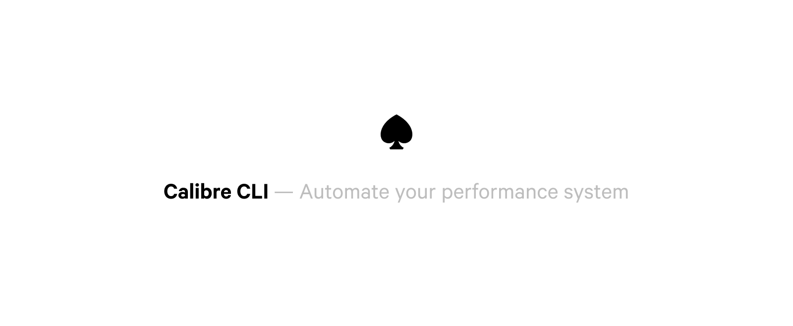

[](https://buildkite.com/calibre/terminal-cli)

## Installation

To get the latest version, run this command:

```
npm install -g calibre
```

Standalone binaries are available for download at [https://calibreapp.com/cli](calibreapp.com/cli)

Optionally, you can clone this repo and run `npm run build` to
produce a standalone binary for Mac, Windows or Linux.

## Authentication

All authentication is handled via an environment variable: `CALIBRE_API_TOKEN`. You can create an API token from the API

## Usage

```
$ calibre --help
```

## Node client

The Calibre package exports a node API that can be used to automate your performance system however you’d like to. 

If you’d like to splunk around check `src/api/`.

```
const { Site, Snapshot, Test } = require('calibre')

// List all sites for your account
const sites = await Site.list()
const site = sites[0]

// Create a snapshot for the first site
await Snapshot.create({ site: site.slug })
```
